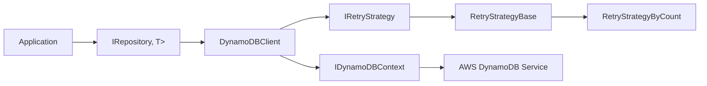
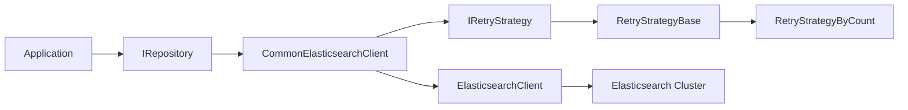

# Architecture Overview

This document provides a full architectural overview of the MnM.Common.Data ecosystem, including dedicated diagrams for each technology stack:

- SQL Server / Dapper
- DynamoDB
- Elasticsearch

All diagrams use Mermaid syntax.

---

# 1. Full System Architecture

```mermaid
flowchart TB
subgraph App[Application Layer]
    Svc[Application Services]
end
subgraph RepoLayer[Repository Layer]
    RepoIface[IRepository<TClient, TReturn>]
    RepoImpl[Repository<TClient, TReturn>]
    Spec[Specifications]
    RepoIface --> RepoImpl
    RepoImpl --> Spec
end
Svc --> RepoIface
subgraph Clients[Client Abstractions]
    subgraph Sql[Dapper / SQL]
        IDb[IDbClient]
        DbClient[DbClient<TException>]
        SqlDb[SqlServerDbClient]
        IDb <.. DbClient
        DbClient <.. SqlDb
    end
    subgraph Dyn[DynamoDB]
        IDyn[IDynamoDBClient<T>]
        DynClient[DynamoDBClient<T>]
        IDyn <.. DynClient
    end
    subgraph Es[Elasticsearch]
        IEs[ICommonElasticsearchClient]
        EsClient[CommonElasticsearchClient]
        IEs <.. EsClient
    end
end
RepoImpl --> IDb
RepoImpl --> IDyn
RepoImpl --> IEs
subgraph Providers[Underlying Providers]
    DBConn[DbConnection]
    Dapper[Dapper Engine]
    DynCtx[IDynamoDBContext]
    EsNet[ElasticsearchClient]
end
DbClient --> DBConn
DbClient --> Dapper
DynClient --> DynCtx
EsClient --> EsNet
subgraph Retry[Retry Strategies]
    IRetry[IRetryStrategy]
    RetryBase[RetryStrategyBase]
    RetryCount[RetryStrategyByCount]
    SqlRetry[SqlServerRetryStrategy]
end
DbClient --> IRetry
DynClient --> IRetry
EsClient --> IRetry
IRetry <.. RetryBase
RetryBase <.. RetryCount
RetryBase <.. SqlRetry
subgraph DI[Dependency Injection Modules]
    DapperDI[AddDapperRepository]
    DynDI[AddDynamoDBRepository]
    EsDI[AddElasticsearchRepository]
end
DapperDI --> RepoIface
DynDI --> RepoIface
EsDI --> RepoIface
```

---

# 2. SQL Server / Dapper Architecture

```mermaid
flowchart LR
A[Application] --> Repo[IRepository<IDbClient, T>]
Repo --> DbClient[DbClient<TException>]
DbClient --> SqlDb[SqlServerDbClient]
SqlDb --> Conn[DbConnection (SqlConnection)]
DbClient --> Dapper[Dapper Mapping Layer]
Dapper --> ColumnMap[ColumnAttributeTypeMapper]
Dapper --> FallbackMap[FallbackTypeMapper]
Dapper --> Params[ParameterManager]
DbClient --> Retry[IRetryStrategy]
Retry --> RetryBase[RetryStrategyBase]
RetryBase --> SqlRetry[SqlServerRetryStrategy]
```

---

# 3. DynamoDB Architecture



---

# 4. Elasticsearch Architecture



---

# Summary

This architecture demonstrates a highly modular, consistent, and testable data access system:

- All technologies share **common retry logic**, **common repository pattern**, and **common DI conventions**.
- Each backend (SQL Server, DynamoDB, Elasticsearch) has a 1st-class, dedicated client abstraction.
- Dapper, DynamoDBContext, and ElasticsearchClient remain safely encapsulated behind these abstractions.
