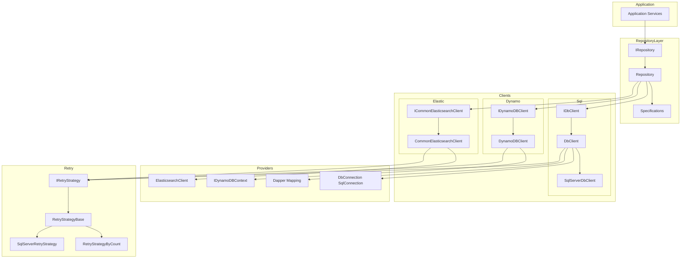
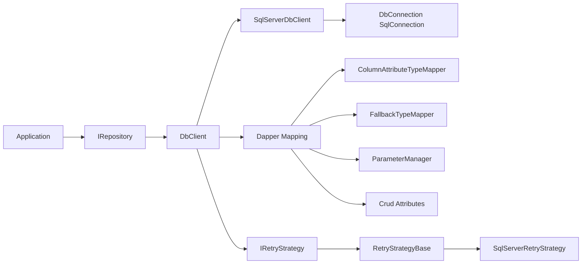
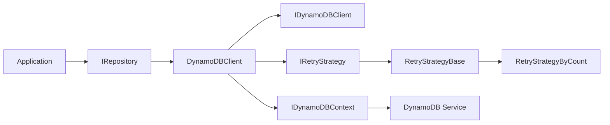
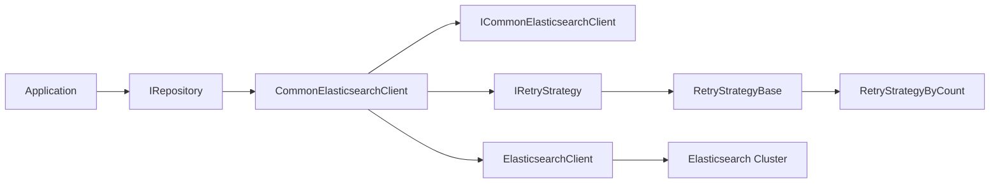

# Architecture Overview (GitHub‑Safe Mermaid)

This file contains **GitHub‑compatible Mermaid diagrams**.  
All labels avoid parentheses, angle brackets, HTML entities, or multiline text.

---

## 1. Full System Architecture

---

## 2. SQL Server and Dapper Architecture

---

## 3. DynamoDB Architecture

---

## 4. Elasticsearch Architecture

---

## Summary

These diagrams are simplified to comply with GitHub's Mermaid renderer:

- No parentheses in node labels  
- No special characters  
- Only `-->` arrows  
- Single‑line labels  
