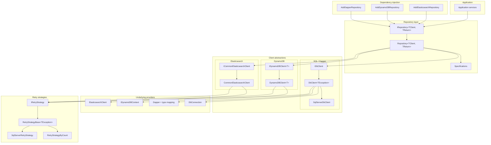
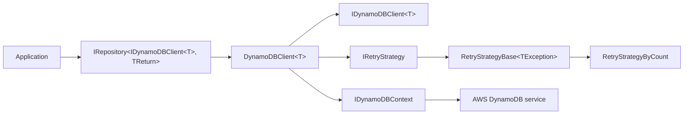
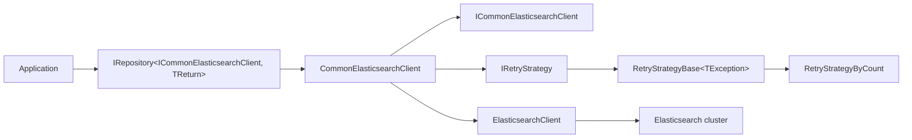

# Architecture Overview

This document provides a full architectural overview of the MnM.Common.Data ecosystem, including dedicated diagrams for each technology stack:

- SQL Server / Dapper
- DynamoDB
- Elasticsearch

All diagrams use Mermaid syntax and are written to be compatible with GitHub's Mermaid renderer (only `-->` arrows, simple labels).

---

## 1. Full System Architecture



---

## 2. SQL Server / Dapper Architecture

```mermaid
flowchart LR
  App[Application] --> Repo[IRepository&lt;IDbClient, TReturn&gt;]
  Repo --> DbClient[DbClient&lt;TException&gt;]
  DbClient --> SqlDb[SqlServerDbClient]
  SqlDb --> Conn[DbConnection (SqlConnection)]

  DbClient --> Dapper[Dapper + mapping]
  Dapper --> ColumnMap[ColumnAttributeTypeMapper]
  Dapper --> FallbackMap[FallbackTypeMapper]
  Dapper --> Params[ParameterManager]
  Dapper --> Crud[CrudMethod + attributes]

  DbClient --> Retry[IRetryStrategy]
  Retry --> RetryBase[RetryStrategyBase&lt;TException&gt;]
  RetryBase --> SqlRetry[SqlServerRetryStrategy]
```

---

## 3. DynamoDB Architecture



---

## 4. Elasticsearch Architecture



---

## Summary

This architecture demonstrates a modular, consistent, and testable data access system:

- All technologies share common retry logic, a common repository pattern, and DI conventions.
- Each backend (SQL Server, DynamoDB, Elasticsearch) has its own client abstraction.
- Low-level providers (Dapper, DynamoDBContext, ElasticsearchClient) are encapsulated behind these abstractions.
