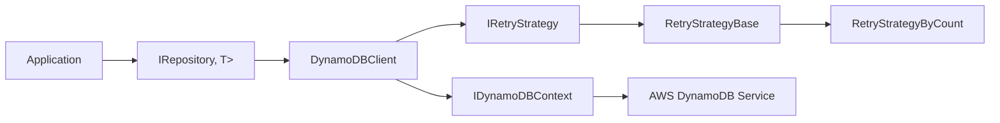
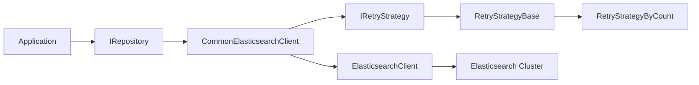

# Architecture Overview

This document provides a full architectural overview of the MnM.Common.Data ecosystem, including dedicated diagrams for each technology stack:

- SQL Server / Dapper
- DynamoDB
- Elasticsearch

All diagrams use Mermaid syntax.

---

# 1. Full System Architecture

```mermaid
flowchart TB

%% ===========================
%% Top-level: Application
%% ===========================
subgraph App[Application Layer]
    Svc[Application Services\n(Use Cases, APIs, etc.)]
end

%% ===========================
%% Repository Layer
%% ===========================
subgraph RepoLayer[Repository Layer]
    RepoIface[IRepository<TClient, TReturn>]
    RepoImpl[Repository<TClient, TReturn>]
    Spec[Specifications\n(IQuerySpecification,\nIQueryListSpecification,\nINonQuerySpecification\n+ async variants)]
    
    RepoIface --> RepoImpl
    RepoImpl --> Spec
end

Svc --> RepoIface

%% ===========================
%% Concrete Client Types
%% ===========================
subgraph Clients[Client Abstractions]
    subgraph SqlClients[Relational / Dapper]
        IDb[IDbClient]
        DbClient[DbClient<TException>]
        SqlDb[SqlServerDbClient]
        
        IDb <.. DbClient
        DbClient <.. SqlDb
    end

    subgraph DynamoClients[DynamoDB]
        IDyn[IDynamoDBClient<T>]
        DynClient[DynamoDBClient<T>]
        
        IDyn <.. DynClient
    end

    subgraph EsClients[Elasticsearch]
        IEs[ICommonElasticsearchClient]
        EsClient[CommonElasticsearchClient]
        
        IEs <.. EsClient
    end
end

RepoImpl --> IDb
RepoImpl --> IDyn
RepoImpl --> IEs

%% ===========================
%% Underlying Providers
%% ===========================
subgraph Providers[Underlying Providers]
    DBConn[DbConnection\n(SqlConnection, etc.)]
    Dapper[Dapper + Type Mapping\n(ColumnAttributeTypeMapper,\nFallbackTypeMapper,\nParameterManager,\nCrudMethod + Attributes)]
    
    DynCtx[IDynamoDBContext]
    AwsDDB[AWS DynamoDB\n(Service)]
    
    EsNet[ElasticsearchClient]
    EsCluster[Elasticsearch Cluster]
end

DbClient --> DBConn
DbClient --> Dapper

DynClient --> DynCtx
DynCtx --> AwsDDB

EsClient --> EsNet
EsNet --> EsCluster

%% ===========================
%% Retry Strategies
%% ===========================
subgraph Retry[Retry Strategy Layer]
    IRetry[IRetryStrategy]
    RetryBase[RetryStrategyBase<TException>]
    RetryCount[RetryStrategyByCount]
    SqlRetry[SqlServerRetryStrategy]
end

DbClient --> IRetry
DynClient --> IRetry
EsClient --> IRetry

IRetry <.. RetryBase
RetryBase <.. RetryCount
RetryBase <.. SqlRetry

%% ===========================
%% DI / Configuration
%% ===========================
subgraph DI[Dependency Injection / Configuration]
    subgraph DapperDI[Dapper / SQL Server DI]
        DapperOpts[DapperRepositoryConfigurationOptions<TClient>\n(ClientFactory,\nCaseSensitiveColumnMapping)]
        AddDapperRepo[AddDapperRepository<\nTClient, TReturn>]
    end

    subgraph DynDI[DynamoDB DI]
        DynOpts[DynamoDBRepositoryConfigurationOptions\n(DynamoDBContext,\nRetryStrategy)]
        AddDynRepo[AddDynamoDBRepository<\nTReturn, TKey>]
    end

    subgraph EsDI[Elasticsearch DI]
        EsOpts[ElasticsearchRepositoryConfigurationOptions\n(ElasticsearchClientSettings,\nRetryStrategy)]
        AddEsRepo[AddElasticsearchRepository<TReturn>]
    end
end

AddDapperRepo --> RepoIface
AddDapperRepo --> DbClient

AddDynRepo --> RepoIface
AddDynRepo --> DynClient

AddEsRepo --> RepoIface
AddEsRepo --> EsClient

DapperOpts --> AddDapperRepo
DynOpts --> AddDynRepo
EsOpts --> AddEsRepo
```

---

# 2. SQL Server / Dapper Architecture

```mermaid
flowchart LR
A[Application] --> Repo[IRepository<IDbClient, T>]
Repo --> DbClient[DbClient<TException>]
DbClient --> SqlDb[SqlServerDbClient]
SqlDb --> Conn[DbConnection (SqlConnection)]
DbClient --> Dapper[Dapper Mapping Layer]
Dapper --> ColumnMap[ColumnAttributeTypeMapper]
Dapper --> FallbackMap[FallbackTypeMapper]
Dapper --> Params[ParameterManager]
DbClient --> Retry[IRetryStrategy]
Retry --> RetryBase[RetryStrategyBase]
RetryBase --> SqlRetry[SqlServerRetryStrategy]
```

---

# 3. DynamoDB Architecture



---

# 4. Elasticsearch Architecture



---

# Summary

This architecture demonstrates a highly modular, consistent, and testable data access system:

- All technologies share **common retry logic**, **common repository pattern**, and **common DI conventions**.
- Each backend (SQL Server, DynamoDB, Elasticsearch) has a 1st-class, dedicated client abstraction.
- Dapper, DynamoDBContext, and ElasticsearchClient remain safely encapsulated behind these abstractions.
